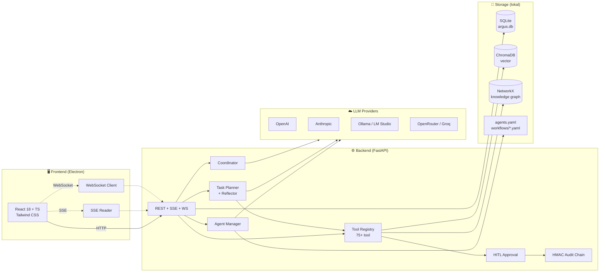

<p align="center">
  
</p>

# 👁️ Argus — Çoklu Ajan Sistemi

> **"Aynı anda her şeyi gören çoklu ajan sistemi."**
> *Adını mitolojideki yüz gözlü dev Argus'tan alan; yerel çalışan, çoklu-ajanlı ve çoklu-LLM destekli yeni nesil yapay zeka asistan platformu.*

[](LICENSE)
[](https://www.python.org/downloads/)
[](https://nodejs.org/)
[](https://www.electronjs.org/)

---

## 🎯 Nedir?

Argus, masaüstünde **birden fazla AI ajanını** tek bir çatı altında ve tamamen yerel kontrolle yöneten bir uygulamadır. Her ajanın kendi rolü, system prompt'u, LLM sağlayıcısı (OpenAI / Anthropic / Local Ollama / OpenRouter vb.) ve güvenlik izinleri bağımsız olarak ayarlanabilir.

Sıradan sohbet arayüzlerinden farklı olarak Argus; **plan tabanlı görev yürütme**, **adım adım yansıtma (reflection)**, **insan onaylı (HITL) parametre düzenleme**, **etkileşimli bilgi grafikleri** ve zengin bir sistem aracı kataloğu sunar.

---

## ✨ Öne Çıkan Gelişmiş Özellikler

### 👥 1. Ajan Şablon Galerisi (Hızlı Başlangıç)
*   Ajan oluşturma ekranında yer alan şablon galerisi sayesinde, tek tıkla profesyonel ajan profillerini (Yazılım Geliştirici, Araştırmacı Asistan, İçerik Yazarı, DevOps Mühendisi) aktif hale getirebilirsiniz.

### 🌐 2. İnteraktif Canvas Bilgi Grafiği Görselleştirici
*   Ajanların belleklerinde biriktirdiği kavramsal ilişkileri, HTML5 Canvas tabanlı interaktif bir fizik motoru (Coulomb itmesi & Hooke çekimi) eşliğinde sürükleyip, yakınlaştırıp (zoom/pan) analiz edebilirsiniz.

### 🛡️ 3. İnce Taneli HITL Parametre Düzenleme
*   Ajanların yapacağı kritik işlemler (örneğin terminal komutu çalıştırma) onaya düştüğünde, yalnızca onaylamakla kalmaz; çalıştırılacak parametreleri **JSON editörü üzerinden düzenleyip** ajanın güncellenmiş parametrelerle devam etmesini sağlayabilirsiniz.

### ⚙️ 4. Güvenli SQLite Eşzamanlılık (WAL Modu)
*   Arka planda aynı anda çalışan birden fazla ajan ve süreç veritabanına yazarken oluşan SQLite kilitlenmeleri (`database is locked`), otomatik olarak aktif edilen WAL (Write-Ahead Logging) pragma moduyla tamamen çözülmüştür.

### 🛠️ 5. Zengin Geliştirici Araçları (Toolbox)
*   **`read_webpage_markdown`**: Jina Reader entegrasyonu ile web dokümanlarını saniyeler içinde tertemiz Markdown olarak kazır.
*   **`install_project_dependency`**: Proje sanal ortamına (`pip` veya `npm`) izole ve güvenli paketler kurar.
*   **`github_api`**: Ajanın doğrudan GitHub API'leri ile konuşarak PR açmasını, issue yönetmesini ve yorum eklemesini sağlar.
*   **`docker_sandbox_run`**: Ajanların yazacağı kodları ana sisteme zarar vermeden izole bir Docker konteyneri içinde çalıştırır.
*   **`parse_layout_document`**: PDF/Word dökümanlarını tablo yapılarını ve sayfalarını koruyarak düz metne dönüştürür.

---

## 🏗️ Mimari Şema



---

## 🚀 Hızlı Başlangıç (5 Dakika)

### 1. Windows Üzerinde Başlatma (Tek Tık)

```powershell
# Depoyu klonlayın
git clone https://github.com/argus-team/argus
cd argus

# Sanal ortam oluşturup backend gereksinimlerini kurun
python -m venv .venv
.\.venv\Scripts\Activate.ps1
pip install -r backend/requirements.txt

# Arayüz bağımlılıklarını kurun
cd frontend
npm install
cd ..

# Kök dizindeki tek-tık başlatıcıyı çalıştırın
.\start.bat
```

### 2. Linux / macOS Üzerinde Başlatma

```bash
git clone https://github.com/argus-team/argus
cd argus

python3 -m venv .venv
source .venv/bin/activate
pip install -r backend/requirements.txt

cd frontend
npm install
npm run electron:dev
```

---

## 🧪 Testleri Çalıştırma

Gelişmiş araçlar ve SQLite veritabanı eşzamanlılığı için hazırlanan tüm testleri koşturmak için:

```bash
cd backend
..\.venv\Scripts\python.exe -m pytest
```

---

## 📜 Lisans

Argus, [MIT Lisansı](LICENSE) altında özgürce dağıtılmaktadır.

---

<p align="center">
  <sub>Argus · v0.4.0 · 2026 · Made with ❤️</sub>
</p>