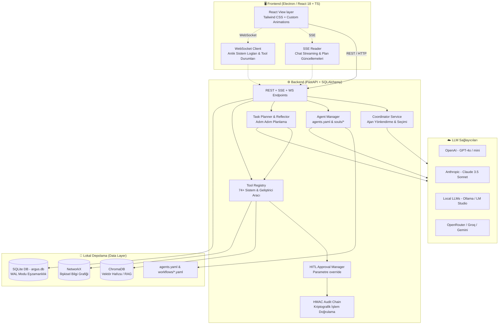

<p align="center">
  
</p>

# 👁️ Argus — Çoklu Ajan Sistemi (UmtalAgent)

> **"Aynı anda her şeyi gören, otonom ve yerel çoklu ajan platformu."**
> 
> *Adını mitolojideki yüz gözlü dev Argus'tan alan; yerel çalışan, çoklu-ajanlı (multi-agent) ve çoklu-LLM destekli yeni nesil yapay zeka asistan platformu. Electron (React + TS) ve FastAPI mimarisiyle sıradan sohbet pencerelerini aşan; planlama, yansıtma (reflection), ince taneli HITL kontrolü ve interaktif kavramsal ilişki grafikleri sunan tam donanımlı bir geliştirici ortamıdır.*

---

## 🎯 Nedir ve Neden Farklıdır?

Argus, masaüstünüzde tamamen yerel kontrolle çalışan ve **birden fazla AI ajanını** tek bir orkestrasyon çatısı altında birleştiren gelişmiş bir sistemdir. Geleneksel AI sohbet arayüzlerinin aksine Argus, bağımsız karar mekanizmalarıyla çalışır:

1. **Ajan Tabanlı Otonom Yapı:** Her ajanın kendi rolü (yazılım geliştirici, araştırmacı asistan, DevOps, içerik yazarı vb.), kendine has sistem yönergesi (`soul.md`), seçili LLM sağlayıcısı ve özel güvenlik/sistem izinleri vardır.
2. **Plan-Driven Görev Yürütme:** Ajanlar bir kullanıcı isteği aldığında doğrudan cevap yazmak yerine arka planda adım adım bir **yapılacaklar planı** çıkartır, bu planı yansıtır (reflect) ve araçları (tools) kullanarak planı sırayla icra eder.
3. **İnsan Onaylı (HITL) Güvenlik:** Ajanın terminal komutları çalıştırma veya dosya yazma gibi hassas sistem araçlarını kullanmadan önce kullanıcıdan izin almasını sağlar. Kullanıcı sadece izin vermekle kalmaz; parametreleri JSON düzeyinde düzenleyip gönderebilir.
4. **Kavramsal Hafıza ve Bilgi Grafiği:** Ajanların yaptığı araştırmalardan elde ettiği veriler ve hafıza kayıtları, interaktif bir HTML5 Canvas fizik motoru üzerinde anlık olarak ilişkisel düğümler (nodes/edges) şeklinde izlenebilir.

---

## 🏗️ Sistem Mimarisi ve Veri Akışı

Argus, modern bir masaüstü uygulaması olarak üç ana katmanda tasarlanmıştır:



### İletişim Protokolleri
*   **REST API:** Ajan oluşturma, düzenleme, silme, dosya gezgini ve çevre ayarlarının yönetimi için kullanılır.
*   **SSE (Server-Sent Events):** LLM'den gelen metin akışlarını (streaming) ve otonom planlama adımlarının arayüze anlık olarak yansıtılmasını sağlar.
*   **WebSocket:** Arka planda çalışan sistem araçlarının detaylı çıktılarını, terminal loglarını ve anlık görev durumlarını kesintisiz izlemek için kullanılır.

---

## ✨ Öne Çıkan Gelişmiş Özellikler

### 👥 1. Coordinator (Koordinatör) Ajanı ve Yönlendirme
*   Kullanıcı bir mesaj yazıp göndermeden önce arka planda çalışan **Coordinator**, isteğin amacını analiz eder.
*   Projedeki tüm aktif ajanların yeteneklerini ve system prompt'larını tarayarak "Bu görevi en iyi **Yeliştirici Ajan** veya **Araştırmacı Ajan** yapabilir" şeklinde dinamik tavsiyeler üretir.
*   Kullanıcı tek tıklamayla sohbet akışını en uygun ajana devredebilir.

### 🛡️ 2. İnce Taneli HITL Parametre Düzenleme (Parameter Overrides)
*   Ajan tehlikeli bir araç (örneğin terminal komutu çalıştırma veya git commit yapma) tetiklediğinde, sistem bunu duraklatır ve onay onay kuyruğuna alır.
*   Kullanıcı arayüzdeki JSON Editörü sayesinde çalışacak parametreleri (örneğin komut parametreleri, dosya yolları vb.) elle düzenleyebilir.
*   Böylece ajan sizin düzelttiğiniz argümanlarla güvenli ve hatasız bir şekilde çalışmaya devam eder.

### 🌐 3. Canvas Tabanlı İnteraktif Bilgi Grafiği
*   Ajanların çalışma esnasında elde ettiği kavramsal ilişkiler (örneğin `Ajan A` -> `Kullanıcı B` -> `Veritabanı C`), NetworkX üzerinde modellenir.
*   Frontend tarafında HTML5 Canvas tabanlı, **Coulomb İtmesi** ve **Hooke Çekimi** tabanlı bir fizik motoru yardımıyla bu kavramlar görselleştirilir.
*   Grafik üzerinde sürükleme (drag), yakınlaştırma (zoom/pan) ve düğüm detaylarını inceleme özellikleri tamamen interaktiftir.

### ⚙️ 4. SQLite WAL (Write-Ahead Logging) Modu
*   Aynı anda çok sayıda ajanın veritabanına veri yazması durumunda oluşan SQLite kilitlenmeleri (`database is locked` hatası), veritabanı motoruna entegre edilen `PRAGMA journal_mode=WAL` ve `busy_timeout=30000` yapılandırmasıyla tamamen çözülmüştür.
*   Arka plandaki yoğun paralel yazma süreçleri birbirini engellemeden pürüzsüzce yürütülür.

### 🛠️ 5. Skill Learning (Makro Yetenek Çıkarımı)
*   Ajan, otonom olarak çalıştırdığı bir dizi başarılı komut ve işlem adımlarını analiz ederek bunları bir **Skill (Yetenek)** olarak formüle edebilir.
*   Oluşturulan bu makrolar daha sonraki görevlerde bağımsız birer araç (tool) gibi diğer ajanlar tarafından da yeniden kullanılabilir.

### 🔊 6. Entegre Ses Desteği (STT & TTS)
*   Sesli etkileşim butonu sayesinde konuşarak mesaj girişi yapılabilir.
*   Ajanın ürettiği yanıtlar, mesaj kutusundaki **Sesli Oku (🔊)** butonu yardımıyla anlık olarak konuşmaya (Text-to-Speech) dönüştürülür.

### 🔑 7. HMAC-SHA256 Audit Log Güvenlik Zinciri
*   Sistemde ajanlar tarafından gerçekleştirilen tüm işlemler (tool çağrıları, dosya yazmaları, onay kararları) kriptografik olarak imzalanır.
*   Audit log zinciri, işlem geçmişinin sonradan değiştirilemeyeceğini ve manipüle edilemeyeceğini doğrular (zero-trust security model).

---

## 🛠️ Sistem Araç Kataloğu (74+ Entegre Tool)

Argus, ajanların işletim sistemi ve dış servislerle etkileşime girmesi için zengin bir araç kataloğu barındırır. Öne çıkan araç kategorileri ve işlevleri şunlardır:

| Kategori | Araç Adı / Kodu | Açıklama ve Kullanım Amacı |
| :--- | :--- | :--- |
| **İzole Çalıştırma** | `docker_sandbox_run` | Ajanın yazdığı kodları ana sisteme zarar vermeden izole bir Docker konteynerinde test etmesini sağlar. |
| **Web & Doküman** | `read_webpage_markdown` | Jina Reader API'lerini kullanarak web sayfalarını reklamsız, temiz Markdown metnine dönüştürür. |
| **Sürüm Kontrolü** | `github_api` | Ajanın doğrudan GitHub üzerinde PR açmasını, issue yönetmesini ve commit'leri kontrol etmesini sağlar. |
| **Paket Yönetimi** | `install_project_dependency` | Projenin sanal ortamına (`pip`) veya frontend dizinine (`npm`) güvenli bir şekilde paket yükler. |
| **Dosya İşleme** | `parse_layout_document` | PDF ve Word belgelerini, içerisindeki tablo yapılarını bozmadan analiz edip düz metin olarak okur. |
| **İşletim Sistemi** | `execute_terminal_command` | Güvenli dizin sınırları içinde terminal komutları yürütür (HITL onayına tabidir). |
| **Vektör Arama** | `vector_db_search` | ChromaDB üzerinde anlamsal (semantic) aramalar yaparak uzun vadeli hafızadan veri çağırır. |

---

## 💻 Teknoloji Yığını (Tech Stack)

### Frontend (Masaüstü Arayüzü)
*   **Electron (v33.0):** Masaüstü entegrasyonu, pencere yönetimi ve yerel işletim sistemi erişimi.
*   **React (v18.3) & TypeScript (v5.6):** Tip güvenli, bileşen tabanlı ve performanslı arayüz yapısı.
*   **Vite (v5.4):** Hızlı geliştirme ortamı (HMR) ve optimize edilmiş production derlemesi.
*   **Tailwind CSS (v3.4):** Modern, esnek ve özelleştirilmiş tasarım sistemi.
*   **CSS Animations (Custom Bezier & Spring):** Modallar ve paneller için göze hoş gelen, spring/overshoot mekanizmalı pürüzsüz geçiş animasyonları.

### Backend (Ajan Çekirdeği)
*   **Python (v3.12+):** Ajan mantığı, veri işleme ve yapay zeka entegrasyonları.
*   **FastAPI (v0.115):** Asenkron, hızlı ve otomatik OpenAPI dokümantasyonlu REST/WS/SSE sunucu katmanı.
*   **SQLAlchemy & SQLite (WAL Mode):** Veritabanı yönetim katmanı ve yüksek eşzamanlı lokal depolama.
*   **ChromaDB:** Ajan hafızaları için yerel vektör veri tabanı (vector store).
*   **NetworkX:** Bellek içi ilişkisel bilgi grafiği oluşturma ve analiz etme.
*   **Docker SDK:** İzole kod çalıştırma ortamlarının (sandbox) yönetimi.

---

## 🗄️ Veritabanı Şeması ve Tablolar

Argus'un veri yapısı yerel SQLite veritabanında (`argus.db`) tutulur ve 10 ana tablodan oluşur:

1.  **`agents`:** Ajanların kimlikleri, rolleri, prompt'ları, LLM modelleri ve özel yapılandırmaları.
2.  **`conversations`:** Oluşturulan sohbet oturumları ve hangi ajanla ilişkilendirildikleri.
3.  **`messages`:** Kullanıcı ve ajan mesajları, yanıt süreleri ve token kullanımları.
4.  **`plans`:** Otonom görevler için ajanlar tarafından hazırlanan adım adım planlar.
5.  **`plan_steps`:** Planların alt adımları, durumları (`pending`, `running`, `success`, `failed`) ve çıktıları.
6.  **`approvals`:** HITL (Human-in-the-loop) onay bekleyen hassas komutlar ve verilen kararlar.
7.  **`tasks`:** Arka planda zamanlanmış veya asenkron yürütülen görev kayıtları.
8.  **`skills`:** Ajanların kendi süreçlerinden öğrenip kaydettiği makro yetenek tanımları.
9.  **`mcp_servers`:** Entegre edilen Model Context Protocol (MCP) sunucu listesi ve durumları.
10. **`audit_logs`:** HMAC-SHA256 imzalı kriptografik denetim zinciri kayıtları.

---

## 🚀 Hızlı Başlangıç (Kurulum ve Çalıştırma)

### Gereksinimler
*   [Node.js 20+](https://nodejs.org/)
*   [Python 3.12+](https://www.python.org/downloads/)
*   [Git](https://git-scm.com/)
*   *Önerilen:* Docker Desktop (İzole sandbox çalıştırmak istiyorsanız)

### 1. Depoyu Klonlayın
```bash
git clone https://github.com/Abdullah6262637/Argus.git
cd Argus
```

### 2. Windows Üzerinde Başlatma (Kolay Kurulum)
Kök dizinde bulunan başlatıcı betikleri otomatik olarak backend sanal ortamını oluşturur, bağımlılıkları yükler ve Electron arayüzünü açar:

**Çift tıklayarak veya Terminalden:**
```powershell
.\start.bat
```
*(Alternatif olarak PowerShell için `.\start.ps1` dosyasını da çalıştırabilirsiniz.)*

### 3. Manuel Kurulum adımları (Tüm İşletim Sistemleri)

#### Backend Kurulumu:
```bash
# Sanal ortam oluşturun ve aktif edin
python -m venv .venv

# Windows için aktif etme:
.venv\Scripts\activate
# Linux/macOS için aktif etme:
source .venv/bin/activate

# Bağımlılıkları yükleyin
pip install -r backend/requirements.txt
```

#### Frontend Kurulumu:
```bash
cd frontend
npm install
```

#### Geliştirici Modunda Çalıştırma:
Frontend klasöründeyken hem backend sunucusunu hem de Electron penceresini tek bir komutla başlatabilirsiniz:
```bash
npm run electron:dev
```

---

## 🧪 Testleri Çalıştırma

Ajanların planlama ve araç icra mekanizmalarının kararlılığını test etmek için backend dizininde `pytest` testlerini koşturabilirsiniz:

```bash
cd backend
# Windows üzerinde sanal ortam aktifken:
python -m pytest
```

---

## 📜 Lisans

Argus, [MIT Lisansı](LICENSE) altında geliştirilen açık kaynaklı ve özgür bir yazılımdır. Ticari veya kişisel amaçlarla özgürce modifiye edilebilir ve dağıtılabilir.

---

<p align="center">
  <sub>Argus · v0.4.0 · 2026 · Made with ❤️</sub>
</p>