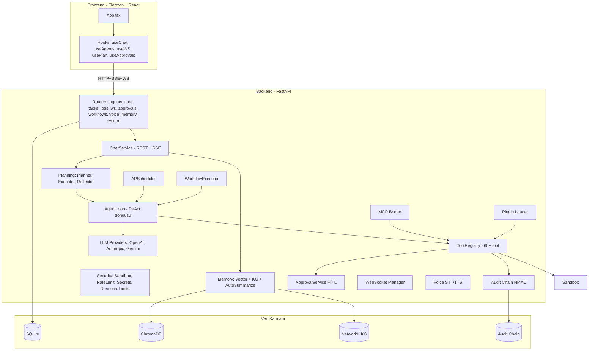

# 🔬 UmtalAgent — Tam Kapsamlı Agent Sistemi Analizi

> **Tarih:** 26 Nisan 2026
> **Mod:** 🏗️ Architect
> **Amaç:** Mevcut projenin "tam kapsamlı agent" tanımına ne kadar yakın olduğunu, neyin var, neyin eksik, neyin çalışıp çalışmadığını maddeler halinde ortaya koymak.

---

## 1. 📊 Yönetici Özeti

UmtalAgent, **OpenClaw / Claude-Code** vizyonuyla geliştirilmiş, çoklu LLM sağlayıcılı, çoklu ajanlı, **plan-driven** otonom bir AI ajan sistemidir. Backend (FastAPI + SQLAlchemy + APScheduler) ve Frontend (Vite + React + TS + Tailwind + Electron) katmanları üretime yakın bir olgunlukta.

### Tek cümleyle durum
> **Çekirdek mimari ve kod %85 hazır; gerçek "tam kapsamlı agent" deneyimini engelleyen şey kod eksikliği değil — test, paketleme, gerçek-dünya entegrasyonu ve birkaç UI bağlantısıdır.**

### Kapsamlılık Skoru

| Boyut | Skor | Yorum |
|---|---|---|
| **Çekirdek mimari** | 9/10 | Modüler, soyutlamalar net |
| **Backend tamamlanmışlığı** | 8.5/10 | v1+v2+v3 büyük ölçüde yazıldı |
| **Frontend tamamlanmışlığı** | 7.5/10 | SSE/Plan UI bağlandı, bazı modal'lar mount değil |
| **Otonom davranış** | 7/10 | Plan/Reflect/Replan canlı çalışıyor |
| **Tool çeşitliliği** | 8/10 | 60+ tool; ses üretim/screen-record eksik |
| **Memory** | 7/10 | Vector + KG + auto-summarize var |
| **Multi-agent** | 6/10 | Delegasyon + workflow var; koordinatör eksik |
| **Güvenlik** | 6.5/10 | HITL+audit+sandbox+secrets var; hard-kill yok |
| **Production-ready** | 4/10 | `.exe` üretiliyor ama Python bağımlılığı paketlenmiyor |
| **Test kapsamı** | 2/10 | 4 test dosyası var, e2e/coverage çok zayıf |
| **Dokümantasyon** | 5/10 | Plan dosyaları zengin, son-kullanıcı kılavuzu zayıf |

**Toplam: ~70/110 → "Tam kapsamlı agent" hedefinin %64'ü**

---

## 2. 🏗️ Mimari Genel Bakış

---

## 3. ✅ Sahip Olduklarımız (ARTILAR)

### 3.1 Backend Çekirdeği — MÜKEMMEL
- **FastAPI lifespan** ile düzgün startup/shutdown
- **CORS spec uyumlu** ([`backend/app/main.py`](../backend/app/main.py:100))
- **Trace-id middleware** + JSON logging
- **41 route** kayıtlı: 10 router (agents, chat, tasks, logs, system, ws, approvals, workflows, voice, memory)
- **Async SQLAlchemy + aiosqlite**
- **7 ORM modeli**: Conversation, Message, ScheduledTask, Log, PlanRecord, PendingApproval, AuditEntry

### 3.2 LLM Soyutlaması — ÇOKLU SAĞLAYICI
| Sağlayıcı | Durum | Native function calling |
|---|---|---|
| **OpenAI** | ✅ | Evet |
| **Anthropic** | ✅ | Evet |
| **Gemini** | ✅ | Evet |
| **OpenAI-compatible proxy** (frostai.xyz, Groq, DeepSeek, xAI, Mistral) | ✅ | Provider üzerinden |
| **Ollama** | ⚠️ Yarım | OpenAI-compat olarak base_url ile çalışır ama özel provider yok |

### 3.3 Otonomi: Plan-Driven Mode — TAM ÇALIŞIYOR
- [`TaskPlanner`](../backend/app/services/planning/planner.py:51) JSON çıktıyla 1-7 step plan
- [`PlanExecutor`](../backend/app/services/planning/executor.py:56) async generator ile SSE stream
- [`ReflectorService`](../backend/app/services/planning/reflector.py:63) PASS/RETRY/REPLAN/FAIL kararı
- **Replan döngüsü**: max 2 replan; retry limit 2
- **Step prompt enjeksiyonu**: önceki step çıktıları context olarak iletiliyor
- **Frontend SSE consumer**: [`useChat`](../frontend/src/hooks/useChat.ts:30) tüm event'leri canlı tüketiyor (`plan_created`, `step_*`, `reflection`, `tool_call_*`, `message_saved`)

### 3.4 Tools — 60+ TOOL
| Kategori | Sayı | Örnekler |
|---|---|---|
| **Dosya** | 11 | read/write/append/copy/move/delete/zip/unzip/search/mkdir |
| **Sistem** | 9 | run_command, open_app, system_info, shutdown, lock_screen, set_volume |
| **Process** | 2 | list_processes, kill_process |
| **Window** | 5 | list/focus/min/max/close window |
| **Ağ** | 3 | http_request, download_file, ping_host |
| **Browser (Playwright)** | 6 | navigate, click, fill, get_text, screenshot, read_webpage |
| **UI otomasyon** | 5 | screenshot, click, type, key_press, mouse_move |
| **Doküman** | 1 | read_document (PDF/DOCX/XLSX/CSV/HTML/MD) |
| **Doküman yazma** | 2 | pdf_generate, xlsx_write |
| **Memory (vector+KG)** | 7 | vector_search/upsert, ingest_document, kg_add_*, kg_query |
| **Git** | 10 | clone, status, pull, push, commit, diff, branch_*, log, init |
| **Email** | 2 | smtp_send, imap_inbox |
| **Database** | 3 | db_query, db_execute, db_schema |
| **Image** | 1 | image_generate (DALL-E) |
| **Messaging** | 3 | slack_send, discord_send, telegram_send |
| **Multi-agent** | 1 | delegate_to_agent (cycle protection) |
| **Code** | 3 | python_eval, evaluate_math, regex_match |
| **Clipboard / Media** | 5 | clipboard_get/set, tts, notification, beep |
| **Memory (basit)** | 4 | save/recall/list/delete |

### 3.5 Memory & Knowledge — KAPSAMLI
- **ChromaDB** vector store (per-agent collection)
- **EmbeddingService**: yerel `sentence-transformers/all-MiniLM-L6-v2` + OpenAI fallback
- **Auto-summarize**: konuşma N mesajı geçince/idle olunca otomatik özet+embed
- **Vector context injection**: her yeni mesajda ilgili `<memory>` bloğu sistem prompt'a ekleniyor
- **Knowledge Graph**: `networkx` + JSON persistence + 4 KG tool

### 3.6 Multi-Agent & Genişletilebilirlik
- **delegate_to_agent**: ajan-ajan iletişim (cycle protection ile)
- **WorkflowExecutor**: YAML tabanlı pipeline (`{{ inputs.X }}`, `{{ steps.id.result }}`)
- **4 örnek workflow**: code_review, daily_news, research_and_report, example
- **12 hazır soul template**: developer, researcher, writer, social_media, devops, data_analyst, project_manager, customer_support, code_reviewer, translator, marketing, tutor
- **Plugin loader**: drop-in `.py` tool'lar
- **MCP bridge**: GERÇEK SDK ile (mcp paketi)

### 3.7 Güvenlik — ORTA SEVİYEDE GÜÇLÜ
- **HITL**: yüksek riskli tool'lar onay bekliyor (run_command, kill_process, shutdown, delete_file)
- **Risk classifier**: rm -rf, format C:, fork bomb pattern detection
- **Audit chain**: HMAC-SHA256 zincirli, sonradan değiştirilemez
- **Sandbox**: komut allowlist + cwd jail
- **Rate limiter**: token bucket per-provider
- **Secrets encryption**: cryptography.fernet + keyring (Sprint 6 için altyapı var)
- **Resource limits**: psutil monitoring (sadece log)

### 3.8 Operasyonel Olgunluk
- **Observability**: trace_id ContextVar, JSON file log, daily rotation
- **Voice**: Whisper STT + edge-tts/pyttsx3 (backend hazır)
- **Browser engine**: Playwright (Chromium auto-install desteği)
- **Scheduler**: APScheduler ile cron tabanlı pasif görevler

### 3.9 Frontend — KULLANILABİLİR
- **3 panelli UI**: AgentList | ChatWindow | SystemPanel
- **22 component**: AgentForm, AgentInspector, ApprovalDialog, ChatWindow, FileBrowser, FileDropZone, KnowledgeGraphModal, MessageBubble, Onboarding, ScreenshotViewer, SystemPanel, TaskTimeline, VoiceButton, WorkflowsModal vs.
- **7 hook**: useAgents, useApprovals, useChat (SSE!), useFirstRun, usePlan, useTheme, useWebSocket
- **Electron**: globalShortcut (Ctrl+Shift+Space), backend launcher
- **API client testleri** (vitest)
- **Playwright E2E altyapısı** (smoke.spec.ts var)

### 3.10 Plan-Aware UI — BAĞLI! (Sprint 1 raporlandı)
- [`App.tsx`](../frontend/src/App.tsx:68) `useChat(selectedId, 'sse')` — varsayılan SSE
- [`App.tsx`](../frontend/src/App.tsx:321) `<ApprovalDialog>` mount edildi
- [`useChat`](../frontend/src/hooks/useChat.ts:114) tüm SSE event'lerini parse ediyor
- Plan, lastReflection, liveToolCalls — ChatWindow prop'larına aktarılıyor

---

## 4. ⚠️ Yarım/Kısmi Olanlar (RİSKLER)

| Bileşen | Durum | Risk |
|---|---|---|
| **Agents.yaml** | Sadece 1 ajan ("SA" — frostai proxy) | Kullanıcı çoklu ajan/template denemiyor |
| **MCP Bridge** | Kod tam, ama `mcp_servers.yaml` yok / boş | MCP tool'ları gerçekte hiç yüklenmiyor |
| **Resource Limits** | Sadece monitoring | Hard-kill yok, kötü ajan durdurulamıyor |
| **AgentInspector tab** | Bileşen var | SystemPanel'de tab olarak görünüyor mu? Doğrulanmadı |
| **Workflow UI** | Modal var (`WorkflowsModal`) | Kullanıcının kolay erişim button'u eksik mi? |
| **Voice frontend** | `VoiceButton` var | ChatWindow'a entegre / otomatik mic onay UX zayıf |
| **KnowledgeGraphModal** | Bileşen var | Görselleştirme: cytoscape mı, custom mu? Doğrulanmadı |
| **Plugin sandbox** | AST tarayıcı ifade edildi | RestrictedPython yorum satırında — gerçek sandbox yok |
| **API key encryption** | secrets.py var | YAML'da hâlâ plain text key var ([`agents.yaml:18`](../backend/agents/agents.yaml:18)) |
| **Rate limiter** | In-memory | Restart'ta sıfırlanıyor (Redis yok) |
| **Audit secret** | `data/audit/.secret` | Yedekleme stratejisi yok; kayıp = zincir kırılır |
| **Test kapsamı** | 4 test dosyası | %5 coverage civarı (health, plugin_sandbox, sandbox, tool_registry) |

---

## 5. ❌ EKSİKLER — "Tam Kapsamlı Agent" İçin Olmayanlar

### 5.1 KRİTİK Eksikler (Production engelleyici)

#### A. Bundling/Paketleme
- ❌ **PyInstaller bundle yok**: `umtalagent.spec` var ama oneFile/oneDir kullanılmıyor
- ❌ **Python embed**: kullanıcıda `.venv` + `Python 3.10+` zorunlu
- ❌ **Playwright Chromium otomatik indirme** akışı yok (manuel `playwright install chromium`)
- ❌ **NSIS installer postinstall** scripti yok ([`installer/umtalagent.nsi`](../installer/umtalagent.nsi:1) statik)
- ❌ **İlk çalıştırma sihirbazı** (Onboarding) `.env` ayarlamayı atlıyor

#### B. Test & CI
- ❌ **GitHub Actions** yok ([`.github/`](../.github/) boş)
- ❌ **pytest coverage** ölçülmüyor; sadece 4 test
- ❌ **vitest test'leri** sadece API client + Icon
- ❌ **Playwright e2e** sadece smoke test
- ❌ **Pre-commit hook** yok

#### C. Dokümantasyon
- ❌ **README v3 değil** — v1 dönemini anlatıyor
- ❌ **docs/user-guide.md** mevcut ama ince
- ❌ **docs/dev-guide.md** mevcut ama ince
- ❌ **Tool yazma kılavuzu** yok
- ❌ **Provider ekleme kılavuzu** yok
- ❌ **Demo video / GIF** yok

### 5.2 ÖZELLİK Eksikleri (Tam Kapsamlı için)

#### D. Provider
- ❌ **Native Ollama provider** (sadece `base_url` workaround)
- ❌ **Native Groq/Mistral/DeepSeek/xAI** provider'ları
- ❌ **LM Studio** entegrasyonu (yerel GUI)
- ❌ **Provider auto-discovery** (kullanıcının Ollama modellerini listele)

#### E. Tool'lar
| Eksik Tool | Niçin Lazım |
|---|---|
| ❌ `screen_record` | Demo, eğitim videosu |
| ❌ `audio_transcribe_long` | Mevcut voice sadece kısa input |
| ❌ `calendar_*` (Google/Outlook) | Pasif görev otomasyonu |
| ❌ `youtube_search/transcript` | Araştırma ajanı için kritik |
| ❌ `arxiv_search` | Akademik araştırma |
| ❌ `wikipedia` (yapılandırılmış) | Şu an web_search kullanılıyor |
| ❌ `excel_read_advanced` (formül, multi-sheet) | sadece read_document var |
| ❌ `pptx_generate` | Sunum üretme |
| ❌ `markdown_to_html` | Rapor publishing |
| ❌ `web_scrape_structured` (cheerio benzeri selector API) | Browser tool var ama ham |
| ❌ `notion/airtable/sheets` | Modern bilgi yönetimi |
| ❌ `vision_describe_image` | Multi-modal input |
| ❌ `docker_*` | DevOps ajanı |
| ❌ `kubernetes_*` | DevOps ajanı |
| ❌ `aws/azure/gcp_*` | Cloud DevOps |

#### F. Otonomi & Akıl
- ❌ **Coordinator/Orchestrator agent** (otomatik delegasyon, görevin hangi ajana gideceğine karar verir)
- ❌ **Skill learning**: ajan başarılı pattern'leri öğrenip vector store'a kaydetmiyor (yarı var ama kullanılmıyor)
- ❌ **Multi-step parallel execution** (şu an sadece sıralı)
- ❌ **Tool composition / macro tool**: 3-4 tool'un birleştirildiği "save_screenshot_to_pdf" gibi makrolar yok
- ❌ **Prompt versioning / A-B test** (soul.md değiştirilince eski versiyonlar takip edilmiyor)
- ❌ **Self-debugging**: Plan failed → ajan kendi başına root-cause + retry-with-fix yapmıyor (Reflector basit)

#### G. UI/UX
- ❌ **AgentInspector** SystemPanel'de tab olarak çıkıyor mu — doğrulanmamış (3.10'da bahsedildi ama kod taranmadı)
- ❌ **Workflow editor**: YAML elle yazılıyor, drag-drop GUI yok
- ❌ **Soul.md WYSIWYG editor**: AgentForm metin alanı düz textarea
- ❌ **Tool izin matrisi UI'sı**: AgentForm'da boolean'lar var ama kategoriler/açıklama eksik
- ❌ **Konuşma export** (PDF/MD/JSON tek-tıkla)
- ❌ **Mesaj reaksiyon** (👍/👎 → fine-tune verisi)
- ❌ **Mesaj search**: konuşma içinde Ctrl+F
- ❌ **Theme**: sadece dark/light, custom renk yok
- ❌ **Multi-conversation tab**: aynı anda 3 ajanla paralel sohbet

#### H. Multi-Tenant / Çok Kullanıcı
- ❌ **Auth yok**: tek kullanıcı varsayımı
- ❌ **API key**: backend'e gelen istekler authenticate değil (localhost varsayımı)
- ❌ **User DB modeli** yok
- ❌ **Workspace ayrımı** (kişi A'nın ajanları kişi B göremez)

#### I. Marketplace / Ekosistem
- ❌ **Soul template galerisi UI**: 12 template dosya olarak var ama AgentForm "şablondan başla" butonu yok
- ❌ **Workflow marketplace**: import/export YAML var ama topluluk paylaşımı yok
- ❌ **Plugin marketplace**: loader var ama register/discovery yok
- ❌ **MCP server gallery**: yapılandırılmış server listesi (Filesystem, GitHub, Slack vb. tek-tık ekleme) yok

#### J. Operasyon
- ❌ **Telemetri opt-in**: kullanım metriği toplama (anonim) yok
- ❌ **Hata raporlama**: Sentry/Rollbar entegrasyonu yok
- ❌ **Update mekanizması**: electron-updater yapılandırması yok
- ❌ **Backup/restore**: kullanıcı tüm DB+config+memory'i yedekleyemiyor

### 5.3 GÜVENLİK Eksikleri

- ❌ **API key plain text in agents.yaml** ([`agents.yaml:18`](../backend/agents/agents.yaml:18))
- ❌ **Hard kill** resource limit aşan ajan için yok
- ❌ **Plugin sandbox** gerçek değil (RestrictedPython yorum satırı)
- ❌ **Per-tool rate limiting**: sadece per-provider var
- ❌ **CSP headers** (Electron renderer için strict CSP yok)
- ❌ **Network egress control**: ajan rastgele URL'lere erişebiliyor
- ❌ **Secret scanning**: kullanıcı yanlışlıkla key'i conversation'a yapıştırırsa otomatik mask yok

---

## 6. 🎯 Öncelik Sıralı Çalışma Listesi

### Sprint A — STABILIZASYON (En kritik)
1. **Agents.yaml zenginleştir**: 12 template'i hazır ajan olarak ekle, kullanıcı sıfırdan başlamasın
2. **API key encryption** zorunlu: secrets.py yaml'a entegre, plain text yasakla
3. **AgentInspector tab** SystemPanel'e gerçekten bağla (doğrula)
4. **Workflow Modal kolay erişim**: Header'a buton
5. **Voice button** ChatWindow input'una entegre
6. **MCP servers.yaml** örnek config + UI'dan yönetim

### Sprint B — TEST & CI
7. pytest %50+ coverage hedefi (planner, executor, reflector, tools)
8. vitest hook + component testleri
9. Playwright e2e: sohbet → plan → tool → onay → memory
10. GitHub Actions: lint + type-check + test + e2e

### Sprint C — PAKETLEME
11. PyInstaller `.spec` dosyasını oneDir bundle olarak güncelle
12. Electron extraResources backend bundle (Python ile)
13. Playwright Chromium auto-install postinstall script
14. NSIS installer first-run wizard
15. electron-updater entegrasyonu

### Sprint D — TOOL GENİŞLEME
16. screen_record, audio_transcribe_long
17. calendar_*, youtube_*, arxiv_*, vision_describe_image
18. docker_*, kubernetes_*, cloud_*

### Sprint E — UX İYİLEŞTİRME
19. Soul template galerisi (AgentForm "şablondan başla")
20. Workflow drag-drop editor
21. Multi-conversation tab
22. Konuşma search + export
23. Tool izin matrisi UI'sı (kategori grupları)

### Sprint F — KOORDİNATÖR & SKILL LEARNING
24. Coordinator agent: kullanıcı isteğini analiz edip uygun ajana yönlendirir
25. Skill memory: başarılı tool zincirlerini "macro tool" olarak kaydet
26. Parallel step execution (executor'da `parallel: true` desteği)

### Sprint G — DOKÜMAN & DEMO
27. README v3 (v2 özelliklerini yansıtır)
28. user-guide + dev-guide genişlet
29. Demo video / GIF kayıtları
30. Tool yazma + provider ekleme + soul yazma kılavuzları

---

## 7. 🧮 Skor Detay

### Pozitif (Artılar)
- Mimari soyutlama mükemmel: LLM provider, tool, planning, memory katmanları temiz
- Plan-driven mod GERÇEKTEN çalışıyor (ChatGPT'nin görmediği bir şey: replan + reflection)
- Tool sayısı ciddi: 60+ ve hepsi schema-correct (OpenAI + Anthropic + native)
- HITL approval + audit chain kurumsal kalitede
- Frontend SSE consumer'ı tam (tüm event'ler parse ediliyor)
- Memory altyapısı zengin (vector + KG + auto-summarize + injection)
- Security primitive'leri (sandbox, rate limit, encryption, resource limits) kurulmuş

### Negatif (Eksiler)
- Test kapsamı düşük (%5 civarı) — refactor güveni zayıf
- Production deployment ham (Python paketlenmiyor)
- Dokümantasyon güncel değil
- agents.yaml fakir (1 ajan); kullanıcı deneyimini kötüleştiriyor
- MCP gerçekte boş (config yok)
- Plain text API key — güvenlik açığı
- Coordinator/Orchestrator yok (multi-agent zayıf kalıyor)
- Kullanıcının "ne yapayım?" sorusuna cevap yok (örnekler/quickstart eksik)

---

## 8. 🚨 Acil Aksiyonlar (1 hafta içi)

| # | Aksiyon | Etki |
|---|---|---|
| 1 | API key'i yaml'dan kaldır, encrypted store'a taşı | Güvenlik |
| 2 | `agents.yaml`'a 12 template ajanı ekle | UX |
| 3 | MCP `mcp_servers.yaml` örnek dosya ekle (filesystem MCP) | Özellik |
| 4 | README'yi v3 olarak güncelle | Dokümantasyon |
| 5 | pytest coverage'ı %30'a çıkar (planner/executor/reflector) | Kalite |
| 6 | PyInstaller bundle başla | Production |
| 7 | Workflow ve Voice button'larını Header'a koy | UX |

---

## 9. 📁 Dosya Sayım Özeti

| Katman | Sayı |
|---|---|
| Backend Python dosyası | ~70 |
| Frontend TS/TSX dosyası | ~35 |
| ORM modeli | 7 |
| Tool sınıfı | 60+ |
| LLM provider | 3 (+OpenAI-compat çok) |
| Soul template | 12 |
| Workflow YAML | 4 |
| Test dosyası (backend) | 4 |
| Test dosyası (frontend) | 3 |
| API endpoint | 41 |
| React component | 22 |
| Hook | 7 |

---

## 10. 🏁 Sonuç

UmtalAgent **OpenClaw seviyesinde bir agent çekirdeğine sahip**. Kod kalitesi iyi, mimari modüler, otonomi gerçek (plan + reflect + replan UI'da görünüyor). Ana eksikler:

1. **Test ve CI** (kalite güvencesi)
2. **Production paketleme** (kullanılabilirlik)
3. **agents.yaml zenginleştirme** (ilk deneyim)
4. **MCP yapılandırma** (özelliği etkin değil)
5. **Coordinator/orkestrator + skill learning** (gerçek otonomi)
6. **Dokümantasyon** (öğrenme)

**Bunların hepsi birkaç sprint mesafesinde.** Proje "ham bir prototip" değil; **"production'a 1-2 ay uzaklıkta üretime yakın bir AI agent platformu"**.

---

## 11. 🗂️ Önerilen Yeni Plan Dosyaları (Code modunda oluşturulacak)

- `plans/sprint-a-stabilizasyon.md`
- `plans/sprint-b-test-ci.md`
- `plans/sprint-c-paketleme.md`
- `plans/sprint-d-tool-genisleme.md`
- `plans/sprint-e-ux-iyilesme.md`
- `plans/sprint-f-koordinator-skill.md`
- `plans/sprint-g-dokuman-demo.md`

> Mevcut eski rapor dosyaları silindikten sonra, bu dosya tek "kuzey yıldızı" referans olarak kalır; yeni sprint planları bu dosyaya atıfta bulunur.