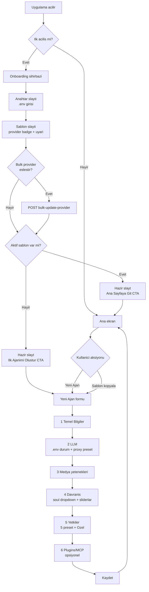

# 🧩 Sprint A.11 — Agent Oluşturma & Onboarding Adaptasyonu

> **Hedef:** Sprint A'da eklenen `.env` GUI yönetimi, 12 hazır şablon ajan, 5 izin kategorisi, soul.md sistemi ve workflow editörünü; mevcut **AgentForm sihirbazı** ve **Onboarding kurulum sihirbazı** ile tam uyumlu hale getirmek.
> **Öncelik:** YÜKSEK
> **Tahmini süre:** 2-3 gün
> **Önkoşul:** Sprint A tamamlandı ([`plans/sprint-a-stabilizasyon.md`](sprint-a-stabilizasyon.md:1))

---

## 1. Özet

Sprint A bittiğinde sistem teknik olarak çalışıyor ama **yeni kullanıcı yolculuğu** parçalı:

- Onboarding'de `.env` doldurulduktan sonra, **şablon seçim slaytında** kullanıcı hangi şablonun hangi provider'ı kullandığını göremiyor.
- AgentForm'daki LLM adımı, `.env`'de zaten anahtar olduğunu **bilmiyor** — kullanıcı her ajan için tekrar tekrar yapıştırıyor.
- Yetkiler adımında 4 boolean elle açılıyor; "Bu ajanın salt-okunur olmasını istiyorum" gibi yaygın senaryolar için kısayol yok.
- AgentForm'da **soul dropdown'u** yok — kullanıcı `souls/developer.md`'yi açıp kopyalamak zorunda.
- Onboarding'in son slaytı her zaman "Yeni Ajan Oluştur" diyor — kullanıcı 12 şablonu aktif bıraktıysa direkt ana sayfaya gitmeli.

Bu sprint, **"5 dakikadan az sürede çalışan bir ajan"** hedefini garanti altına alır.

---

## 2. Mevcut Uyumsuzluklar

| # | Sorun | Şu Anki Durum | Hedef |
|---|---|---|---|
| 1 | AgentForm her ajan için API key sorar | `.env` zaten varsa gereksiz tekrar | `.env`'de key varsa "kullan" seçeneği |
| 2 | AgentForm'da soul dosyası seçilemez | Sadece system_prompt textarea | `souls/*.md` dropdown + inline preview |
| 3 | İzin adımında preset yok | 4 boolean elle açılır | 5 hazır preset + Özel |
| 4 | Onboarding "Şablonlar" provider göstermiyor | Sadece isim + ikon | Provider badge + `.env` durum simgesi |
| 5 | Onboarding bitiminde her zaman "Yeni Ajan" formu açılır | Şablon seçildiyse direkt ana sayfaya gitmeli | Akıllı yönlendirme |
| 6 | Şablon ajanları hep `provider: openai` | Kullanıcının `.env`'inde Anthropic varsa? | Otomatik eşleştirme + bulk update |
| 7 | Workflow / MCP / Plugin yetenekleri AgentForm'da yok | Manuel YAML | Opsiyonel adım (Step 6) |
| 8 | Kök dizinden tek tıkla başlatma yok | `cd frontend && npm run electron:dev` | `start.bat` / `start.ps1` |

---

## 3. Akış Diyagramı



---

## 4. İş Listesi (Detaylı)

### A.11.1 — LLM Adımı: `.env` Farkındalığı + Proxy Preset

**Dosya:** [`frontend/src/components/AgentForm.tsx`](../frontend/src/components/AgentForm.tsx:501) (`StepLLM`)

- Bileşen mount olunca `api.getEnv()` çağrısı.
- `OPENAI_API_KEY` mevcutsa: ✅ yeşil rozet
  *"`.env`'de hazır — bu ajan otomatik kullanır. İstersen aşağıya farklı bir anahtar girerek override edebilirsin."*
- Yoksa: ⚠️ turuncu uyarı + "Ayarlar → API Anahtarları'nı aç" butonu (callback ile dialog açılır).
- Yeni "Proxy Preset" dropdown:
  | Preset | provider | base_url |
  |---|---|---|
  | OpenAI (resmi) | openai | (boş) |
  | frostai.xyz | openai | `https://frostai.xyz/v1` |
  | OpenRouter | openai | `https://openrouter.ai/api/v1` |
  | Groq | openai | `https://api.groq.com/openai/v1` |
  | Together.ai | openai | `https://api.together.xyz/v1` |
  | LM Studio (local) | local | `http://localhost:1234/v1` |
  | Ollama (local) | local | `http://localhost:11434/v1` |
  | Anthropic (resmi) | anthropic | (boş) |
- Seçince `provider` ve `base_url` otomatik dolar.
- "Test Et" yanına yeni link: *".env'deki anahtarla test et"* — `api_key=null` gönderilir.

---

### A.11.2 — Yetkiler Adımı: Hazır Presetler

**Dosya:** [`frontend/src/components/AgentForm.tsx`](../frontend/src/components/AgentForm.tsx:995) (`StepPermissions`)

5 preset radio + "🛠️ Özel" seçeneği:

| Preset | file_system | terminal_cmd | web_search | system_admin | Senaryo |
|---|---|---|---|---|---|
| 🔒 **Salt-okunur** (sadece sohbet) | ❌ | ❌ | ❌ | ❌ | Test, eğlence |
| 🔍 **Araştırmacı** | ❌ | ❌ | ✅ | ❌ | Web araştırma, raporlama |
| ✏️ **Yazar** | ✅ | ❌ | ✅ | ❌ | İçerik üretimi, dosya yazma |
| 💻 **Geliştirici** | ✅ | ✅ | ✅ | ❌ | Kod, git, terminal |
| 👑 **Tam yetkili** | ✅ | ✅ | ✅ | ✅ | Otomasyon, sistem yönetimi |
| 🛠️ **Özel** | manuel | manuel | manuel | manuel | Mevcut 4 kategori bloğu açılır |

- Üst satır: 6 büyük buton — seçim radio gibi.
- Seçilen preset'in tool listesi tooltip'ler ile gösterilir.
- "Özel" seçilince mevcut 4 kategori detayı açılır (Sprint A.10 ile gelen UI).
- Özel'deyken kullanıcı manuel değişirse otomatik "Özel" işaretlenir.

---

### A.11.3 — Davranış Adımı: Soul Seçimi

**Backend yeni endpoint'ler** ([`backend/app/routers/agents.py`](../backend/app/routers/agents.py:1)):

```python
GET    /api/agents/souls               # listele
GET    /api/agents/souls/{name}        # tam içerik
POST   /api/agents/souls               # yeni soul (body: {name, content})
DELETE /api/agents/souls/{name}        # sil (system soul'lar korunur)
```

**Frontend** ([`AgentForm.tsx:856`](../frontend/src/components/AgentForm.tsx:856), `StepBehavior`):

- "System Prompt" textarea üstüne yeni dropdown: **"Soul dosyası"**
  - `developer`, `writer`, `researcher`, ... (souls/ klasöründen)
  - "✏️ Inline yaz" seçeneği — dropdown gizlenir, textarea aktif
- Dropdown'dan seçince textarea otomatik dolar; "Düzenle" butonu yanında.
- Manuel düzenleme yapılırsa "✏️ Düzenlendi (kaydet?)" rozet → "Bu prompt'u soul olarak kaydet" butonu.
- Modal: ad sor → `POST /api/agents/souls`.

---

### A.11.4 — Yeni 6. Adım: Plugins / MCP

**Frontend** yeni `StepPlugins` bileşeni ([`AgentForm.tsx`](../frontend/src/components/AgentForm.tsx:1)):

- `STEPS` dizisine `'Plugins ve MCP'` eklenir → toplam 6 adım.
- İçerik:
  - **Plugins** bölümü — `GET /api/system/plugins` (varsa) listesi
  - **MCP Sunucuları** bölümü — `mcp_servers.yaml` enabled toggle
  - Her birinde checkbox + `title` ile tooltip
- Hepsi opsiyonel; adım atlanabilir (Geri/İleri her zaman aktif).
- Backend tarafında `agents.yaml` içine ajan-ozel `enabled_plugins`/`enabled_mcp` alanları yazılır (yeni şema).

> **Not:** Eğer plugin/MCP sistemi production'da hazır değilse, bu adım "yakında" başlığı ile placeholder olarak kalır.

---

### A.11.5 — Onboarding "Şablonlar" İyileştirmesi

**Dosya:** [`frontend/src/components/Onboarding.tsx`](../frontend/src/components/Onboarding.tsx:14)

- `TEMPLATE_AGENTS` listesi yeni alanla zenginleşir:
  ```ts
  { id, name, icon, desc, provider: 'openai' | 'anthropic', model: 'gpt-4o-mini' }
  ```
- Her kartta:
  - Sol: ikon
  - Sağ: provider badge (`OpenAI` / `Anthropic` / `Local`) + model
  - Alt: `.env` durumu — anahtar yoksa **küçük 🔑⚠️ rozet + tooltip** "OpenAI key yok"
- Üst kısma yeni bölüm:
  ```
  💡 Tüm şablonları benim ana provider'ıma bağla:
  [ OpenAI ▼ ] [ Uygula ] (12 ajanın provider'ını günceller)
  ```
  - "Uygula" → `POST /api/agents/bulk-update-provider`
  - .env'de seçilen provider'ın key'i yoksa **uyarı dialog**: "Önce Anahtar slaytına dön ve key ekle".

---

### A.11.6 — Onboarding "Hazır" Slaytı: Akıllı CTA

**Dosya:** [`frontend/src/components/Onboarding.tsx`](../frontend/src/components/Onboarding.tsx:1) (`ready` slaytı)

```typescript
const hasActiveTemplates = selectedTemplates.size > 0;

if (hasActiveTemplates) {
  // Ana CTA: "Ana Sayfaya Git" (büyük, accent renkte)
  // İkincil: "Yeni Bir Ajan da Oluştur" (küçük, outline)
} else {
  // Tek CTA: "İlk Ajanımı Oluştur" (mevcut davranış)
}
```

- Slayt başlığı da değişir:
  - Şablon var: "*N adet hazır ajan seni bekliyor*"
  - Şablon yok: "*Hadi ilk ajanını oluşturalım*"

---

### A.11.7 — Backend: Bulk Update + Souls CRUD

**Yeni endpoint'ler:**

```python
# backend/app/routers/agents.py

@router.post("/bulk-update-provider")
async def bulk_update_provider(payload: BulkProviderUpdate):
    """
    body: { provider: ProviderName, base_url?: str, agent_ids?: List[str] }
    agent_ids verilmezse template ajanlarına (sa hariç) uygulanır.
    """
    ...

@router.get("/souls")
async def list_souls() -> List[SoulInfo]:
    """souls/*.md dosyalarını listele (name, preview, size)."""

@router.get("/souls/{name}")
async def get_soul(name: str) -> SoulDetail: ...

@router.post("/souls")
async def create_soul(payload: SoulCreate) -> SoulInfo: ...

@router.delete("/souls/{name}", status_code=204)
async def delete_soul(name: str) -> None: ...
```

**Şema:**
```python
class SoulInfo(BaseModel):
    name: str          # "developer"
    preview: str       # ilk 200 karakter
    size: int          # bytes
    is_system: bool    # default soul'lar silinemez

class BulkProviderUpdate(BaseModel):
    provider: ProviderName
    base_url: Optional[str] = None
    agent_ids: Optional[List[str]] = None  # None -> tüm template'ler
```

**Frontend `api/client.ts`:**
```typescript
listSouls(): Promise<SoulInfo[]>
getSoul(name): Promise<SoulDetail>
createSoul(name, content): Promise<SoulInfo>
deleteSoul(name): Promise<void>
bulkUpdateProvider(payload): Promise<{updated: number}>
```

---

### A.11.8 — Header `.env` Durum Rozeti *(Opsiyonel)*

**Dosya:** [`frontend/src/components/Header.tsx`](../frontend/src/components/Header.tsx:1)

- Sağ üstte (Ayarlar ikonu solunda) küçük rozet:
  ```
  🔑  ✓ OpenAI  ✗ Anthropic
  ```
- Tıklayınca → `onOpenSettings()` çağrılır + Settings modal direkt **API Anahtarları** sekmesinde açılır.
- WebSocket ile `/api/system/env` polling (60sn'de bir refresh).
- Mobil dar ekranda sadece anahtar ikonu görünür.

---

### A.11.9 — Başlatma Kısayolları

**Yeni dosyalar:**

`start.bat` (kök dizin):
```batch
@echo off
cd /d "%~dp0frontend"
npm run electron:dev
```

`start.ps1` (kök dizin):
```powershell
Set-Location -Path "$PSScriptRoot\frontend"
npm run electron:dev
```

**README ekleme:**
```markdown
## 🚀 Hızlı Başlatma

Çift tıklayın: **`start.bat`** (Windows) — uygulama otomatik açılır.
```

---

## 5. Test/Kabul Kriterleri (Implementasyon Sonrası)

- [x] **A.11.1** Onboarding'de `.env`'i atlayan kullanıcı, AgentForm LLM adımında **turuncu uyarı** görür
- [x] **A.11.1** Proxy preset dropdown seçimi `provider` ve `base_url`'i otomatik doldurur (8 hazır preset)
- [x] **A.11.2** "🔍 Araştırmacı" preset'i seçilince `web_search=true`, diğerleri `false` olur
- [x] **A.11.2** Manuel checkbox değişimi otomatik "Özel"e geçer (preset radio mantığı)
- [x] **A.11.3** Soul dropdown'dan `developer.md` seçimi system_prompt'u doldurur
- [x] **A.11.3** "Yeni soul olarak kaydet" butonu çalışır, listede yeni isim görünür
- [x] **A.11.4** 6. adım "Plugins/MCP" görünür (placeholder — yakında bilgisi)
- [x] **A.11.5** Şablon kartlarında provider badge (`OpenAI` / `Anthropic` / `Yerel`) görünür
- [x] **A.11.5** `.env`'de gerekli key yokken kartta ⚠️ "key yok" rozeti
- [x] **A.11.5** "Bulk provider güncelle" çalışır, 12 ajan tek seferde değişir
- [x] **A.11.6** Şablon seçildiyse "Ana Sayfaya Git" CTA'sı, seçilmediyse "İlk Ajan" CTA'sı çıkar
- [x] **A.11.7** `GET /api/agents/souls` endpoint 12 soul listeler
- [x] **A.11.7** `POST /api/agents/bulk-update-provider` template ajanları günceller (`sa` hariç)
- [ ] **A.11.8** *(Opsiyonel — Sprint A.12'ye ertelendi)* Header'da `.env` durum rozeti
- [x] **A.11.9** `start.bat` ve `start.ps1` çift tıkla uygulamayı açar

---

## 9. Tamamlanma Özeti

### Yeni Dosyalar
- [`start.bat`](../start.bat:1) — kök dizinden çift tık ile başlatma (Windows CMD)
- [`start.ps1`](../start.ps1:1) — kök dizinden çift tık ile başlatma (PowerShell, port kontrolü ile)

### Backend Değişiklikleri
- [`backend/app/schemas/agent.py`](../backend/app/schemas/agent.py:1) — `SoulInfo`, `SoulDetail`, `SoulCreate`, `BulkProviderUpdateRequest`, `BulkProviderUpdateResponse` şemaları eklendi.
- [`backend/app/routers/agents.py`](../backend/app/routers/agents.py:1) — `GET/POST/DELETE /agents/souls`, `POST /agents/bulk-update-provider` endpoint'leri eklendi. Sistem soul'ları (`_SYSTEM_SOULS`) silinmez.

### Frontend Değişiklikleri
- [`frontend/src/types/index.ts`](../frontend/src/types/index.ts:1) — `SoulInfo`, `SoulDetail`, `BulkProviderUpdateRequest/Response` tipleri ve genişletilmiş `ProviderName` (gemini, ollama, groq, mistral, deepseek, xai, openrouter).
- [`frontend/src/api/client.ts`](../frontend/src/api/client.ts:1) — `listSouls`, `getSoul`, `createSoul`, `deleteSoul`, `bulkUpdateProvider`.
- [`frontend/src/components/AgentForm.tsx`](../frontend/src/components/AgentForm.tsx:1) — yeniden yazıldı:
  - **Step 2 (LLM):** `.env` durum rozeti (yeşil/turuncu), 8 proxy preset dropdown, `.env`-ile-test butonu.
  - **Step 4 (Davranış):** `souls/` dropdown + "yeni soul kaydet" modal'ı + inline manuel yazma.
  - **Step 5 (Yetkiler):** 5 hazır preset (Salt-okunur / Araştırmacı / Yazar / Geliştirici / Tam yetkili) + Özel modu, otomatik preset eşleştirme.
  - **Step 6 (Plugins/MCP):** yeni placeholder adım.
  - `onOpenEnvSettings` prop'u ile Settings → API Anahtarları sekmesine direkt navigasyon.
- [`frontend/src/components/Onboarding.tsx`](../frontend/src/components/Onboarding.tsx:1) — yeniden yazıldı:
  - **Şablonlar slaytı:** her kartta `ProviderBadge`, `.env` key kontrolü ile uyarı, "tüm şablonları aynı provider'a bağla" bulk update widget'ı.
  - **Hazır slaytı:** akıllı CTA — şablon seçildiyse "Ana Sayfaya Git" (+ ikincil "Yeni Ajan"), seçilmediyse "İlk Ajanımı Oluştur".
- [`frontend/src/components/SettingsModal.tsx`](../frontend/src/components/SettingsModal.tsx:1) — `initialTab` prop eklendi (Sprint A.11.1 için AgentForm'dan deep-link).
- [`frontend/src/App.tsx`](../frontend/src/App.tsx:1) — `settingsInitialTab` state + AgentForm'a `onOpenEnvSettings` callback'i.

---

## 6. İmplementasyon Sırası

```mermaid
gantt
    title Sprint A.11 Implementation Order
    dateFormat  X
    axisFormat  Adim %s

    section Backend
    A.11.7 Backend endpoints           :be1, 0, 1d

    section Frontend Forms
    A.11.1 LLM env awareness          :f1, after be1, 0.5d
    A.11.2 Permission presets          :f2, after f1, 0.5d
    A.11.3 Soul dropdown               :f3, after f2, 0.5d
    A.11.4 Plugins step                :f4, after f3, 0.5d

    section Onboarding
    A.11.5 Templates badges            :o1, after be1, 0.5d
    A.11.6 Smart CTA                   :o2, after o1, 0.25d

    section Polish
    A.11.8 Header badge                :p1, after o2, 0.25d
    A.11.9 Startup scripts             :p2, after p1, 0.1d
```



---

## 7. Risk ve Notlar

- **A.11.4 (Plugins/MCP)** — Eğer plugin sistemi tam çalışmıyorsa, sadece "yakında" placeholder ekle.
- **A.11.7 bulk-update** — `sa` (SA varsayılan ajan) korunmalı; sadece template'ler güncellenmeli.
- **Soul silme** — `is_system: true` olanlar (developer, writer vb.) silinmemeli — backend `409 Conflict` döner.
- **Test edilebilirlik** — Sprint B'de bu yeni endpoint'ler için pytest'ler yazılacak.

---

## 8. Sonraki Adım

Sprint B: Test & CI altyapısı + bu sprint'in unit/E2E testleri.